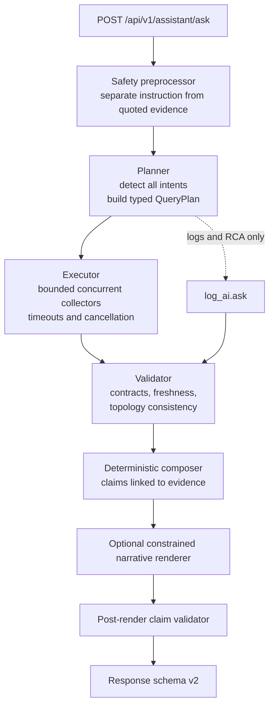

# AI Assistant Solution Design

Date: 2026-07-17  
Revision: 2 (review corrections incorporated 2026-07-18)  
Environment: UAT UAE PostgreSQL HA on OpenShift  
Application: Agentic Patroni Cluster / Object Monitor  
Scope: architecture and acceptance contracts for the defects in `AI_ASSISTANT_CURRENT_SETUP_PROBLEM_ANALYSIS_20260717.md`  
Status: implementation-ready design, subject to the phase gates in `AI_ASSISTANT_NEXT_IMPLEMENTATION_MARKER_20260717.md`

## Executive summary

Replace the single-winner `route()` decision with a typed **Plan -> Execute -> Validate -> Compose** pipeline. Existing deterministic tools remain the execution layer. The design requires no orchestration framework or model replacement.

The assistant remains read-only. Operational claims must come from typed, immutable evidence. A model may classify ambiguous requests or summarize logs, but it may not select arbitrary tools, provide evidence values, authorize operations, or add unsupported factual claims.

## Design principles

1. Deterministic evidence takes precedence over generated text.
2. Detect and retain every supported intent in a combined question.
3. Validate every intent against a typed evidence contract.
4. Represent unavailable, stale, partial, and unsupported evidence explicitly.
5. Bind every operational claim to evidence; narrative polish must not create facts.
6. Treat user text, database content, logs, metrics labels, and retrieved documents as untrusted data.
7. Detect topology changes so concurrently collected facts are not presented as one consistent snapshot when a failover occurred.
8. Keep evaluation expectations independently reviewed; runtime output must never define its own oracle.

## Target architecture



Safety detection annotates or filters the plan; it does not automatically discard a separable factual request. An unsafe request with no separable factual portion returns the fixed safety response without executing collectors.

New package layout:

```text
app/assistant/
    planner.py
    contracts.py
    evidence.py
    executor.py
    validator.py
    composer.py
    safety.py
    schema.py
    transports.py
```

`app/api_ops.py` remains the endpoint, `app/assistant_tools.py` remains the deterministic tool registry during migration, and `app/log_ai.py` is limited to `logs_*` and `rca_*` synthesis.

## Authoritative status model

Do not reuse one enum for different layers.

```python
class OverallStatus(str, Enum):
    ANSWERED = "answered"
    PARTIAL = "partial"
    INSUFFICIENT_EVIDENCE = "insufficient_evidence"
    SOURCE_UNAVAILABLE = "source_unavailable"
    UNSAFE_REQUEST = "unsafe_request"
    GENERATION_FAILED = "generation_failed"

class SectionStatus(str, Enum):
    COMPLETE = "complete"
    PARTIAL = "partial"
    MISSING = "missing"
    STALE = "stale"
    SOURCE_UNAVAILABLE = "source_unavailable"
    INCONSISTENT_SNAPSHOT = "inconsistent_snapshot"
```

Overall status is derived deterministically from section states. One successful and one failed section yields `partial`; all required sources unavailable yields `source_unavailable`; no collector for the requested domain yields `insufficient_evidence`.

## Response schema v2

Existing `answer`, `model`, `intent`, and `evidence` keys remain during a documented compatibility period. The legacy `intent` is the first intent in a stable, versioned priority table and is deprecated; consumers must migrate to `intents`.

```json
{
  "answer": "...",
  "status": "answered",
  "intents": ["replication_physical", "wal_archiver"],
  "sections": [
    {
      "intent": "replication_physical",
      "status": "complete",
      "evidence_ids": ["ev-1"],
      "missing_fields": [],
      "source_errors": []
    }
  ],
  "evidence_items": [
    {
      "id": "ev-1",
      "contract": "PhysicalReplicationEvidence/v1",
      "source": "pg_stat_replication",
      "collected_at": "2026-07-17T09:41:02Z",
      "collection_started_at": "2026-07-17T09:41:01Z",
      "freshness_seconds": 3,
      "cluster_identity": {
        "scope": "uat-pgcluster-uae-ha",
        "system_identifier": "7637033912937340986",
        "primary_member": "uat-pgcluster-uae-dc1-z9qh-0",
        "timeline": 7
      },
      "payload": {}
    }
  ],
  "claims": [
    {"id": "claim-1", "text": "The standby is streaming.", "evidence_ids": ["ev-1"]}
  ],
  "missing_evidence": [],
  "sources_checked": ["pg_stat_replication"],
  "unsupported_claims": [],
  "safety": {"read_only": true, "mutation_executed": false, "injection_detected": false},
  "audit": {}
}
```

Evidence items are immutable after validation. Sensitive payload fields are redacted before persistence or response serialization. Claims without valid evidence references are removed and recorded in `unsupported_claims`; the affected section cannot remain `complete`.

## Planning and intent detection

The planner collects all candidates using:

1. A reviewed DBA phrase lexicon.
2. Token scoring with phrase specificity and token consumption.
3. A constrained classifier only when deterministic layers are empty or ambiguous.

Classifier output is validated against a closed intent enum with `extra="forbid"`. It can name intents only. Invalid output is discarded. Exact GUC names take precedence in the configuration domain. Generic `log` cannot claim phrases such as `archive log`, `WAL segment`, or `transaction log`.

The question "Show physical replication lag and the current archive log number" must plan exactly `replication_physical` and `wal_archiver`. In the answer, ambiguous user wording is normalized to the precise WAL terms below.

## WAL terminology and contract

The assistant must never treat a WAL segment as an Oracle-style archive-log sequence number.

```python
class WalArchiverEvidence(BaseModel):
    model_config = ConfigDict(extra="forbid")
    current_wal_segment: str
    current_wal_lsn: str
    last_archived_wal: str | None
    last_archived_time: datetime | None
    archived_count: int
    failed_count: int
    last_failed_wal: str | None
    last_failed_time: datetime | None
    collected_at: datetime
```

`current_wal_segment` comes from `pg_walfile_name(pg_current_wal_lsn())` on the verified primary. It is not claimed to be archived. `last_archived_wal` and archive success/failure fields come from `pg_stat_archiver` and are labelled separately.

## Snapshot consistency during failover

Each collector records collection start/end plus Patroni scope, PostgreSQL system identifier, primary member, and timeline when applicable. The executor captures a topology fence before and after a composed collection.

If the primary or timeline changes:

- retry idempotent collectors once against the new primary when the request deadline permits;
- otherwise mark affected sections `inconsistent_snapshot`;
- never combine pre- and post-failover values into a confident cluster-wide conclusion.

The response is a bounded-time observation, not a transactional snapshot across Kubernetes, PostgreSQL, Prometheus, and Loki.

## Collector contracts

Every deterministic collector returns a versioned Pydantic contract, never an untyped dictionary. Contracts define required fields, canonical source names, freshness TTL, redaction rules, and answer obligations.

Physical and logical walsenders are classified through one shared function matching Patroni member identities. Logical retained WAL must never be rendered as physical HA replay lag.

New domain collectors:

| Domain | Required composition | Important validity rules |
| --- | --- | --- |
| Memory | Kubernetes requests/limits, cgroup working set/RSS, PostgreSQL memory settings | Report headroom and OOM pressure; model `work_mem` as concurrency-sensitive exposure, not fixed allocation |
| Metrics trends | Prometheus range queries | State window, step, sample count, missing samples and reset handling; calculate min/max/avg/p95 and rate only when valid |
| Storage | Database sizes, WAL filesystem usage, PVC capacity/used/available, growth series | Distinguish provisioned capacity from filesystem usage and database logical size |
| Slow queries | pg_profile interval or persisted `pg_stat_statements` snapshots | Reject deltas spanning `stats_reset`, restart, invalid interval, or incompatible query identity |

Slow-query snapshots require durable baseline metadata: server identity, database OID, query ID, snapshot timestamps, `stats_reset`, PostgreSQL start time, and extension version. Lifetime cumulative totals may be shown as totals but never attributed to a requested incident window.

## Composition and model boundaries

Operational sections use deterministic templates by default. A model may improve wording only from a closed claim set. After rendering, the claim validator must prove that each factual statement maps to evidence IDs and contains no altered numeric value, identity, status, or timestamp. Failure falls back to deterministic text and records `generation_failed` in audit metadata without losing valid evidence.

`log_ai.ask()` handles only log and RCA intent families. Unsupported domains return `insufficient_evidence`, never a generic Loki summary.

## RCA timeline and reasoning contract

RCA requests use the same planner, evidence contracts, snapshot metadata, and claim grounding as factual requests, with an additional chronological correlation stage. Events from PostgreSQL, Patroni, Kubernetes, Prometheus, Loki, and backup sources are normalized to UTC while retaining the original timestamp, source clock, ingestion timestamp, and uncertainty where known.

The RCA response separates:

- **facts**: directly supported observations with evidence IDs and timestamps;
- **hypotheses**: ranked explanations with supporting and contradicting evidence IDs;
- **missing evidence**: sources, intervals, or fields required to confirm or reject a hypothesis;
- **timeline**: stable chronological events with source attribution;
- **conclusion confidence**: a bounded enum derived from evidence completeness, never an unconstrained model score.

Correlation must not imply causation merely from temporal proximity. Clock skew, scrape interval, log-ingestion delay, counter resets, duplicate events, and gaps are represented explicitly. A model may propose hypotheses from the closed evidence set, but it cannot promote a hypothesis to fact. Validation fails any RCA section that lacks claim attribution or mixes facts and hypotheses.

## Safety behavior

The safety preprocessor separates user instructions from quoted or retrieved evidence. Evidence cannot add intents, authorize tools, change read-only policy, or alter the system prompt.

For injection content, the fixed response states:

- database and log content are untrusted evidence;
- evidence cannot authorize a tool call;
- only the user/control plane can authorize an operation;
- read-only mode remains active;
- no mutation was executed.

If a safe factual question is separable, allowed collectors run and the safety block accompanies the answer. Otherwise the overall status is `unsafe_request`. Audit records store a redacted excerpt and stable digest, not secrets or full hostile payloads.

## Operational controls

All transports enforce:

- explicit SQL allowlists and read-only transactions;
- PostgreSQL `statement_timeout`, lock timeout where applicable, and row limits;
- bounded collector concurrency, per-source deadlines, total request deadline, and cancellation on disconnect;
- Prometheus/Loki range and payload limits;
- namespace-scoped Kubernetes RBAC;
- rate limits and per-caller quotas;
- secret, credential, query-text, label, and log-field redaction;
- size-limited audit records with defined retention;
- TLS verification and controlled destination allowlists.

The endpoint never executes mutation-capable tools. No value found in evidence can become a tool name, SQL fragment, URL, namespace, or credential without allowlist validation.

## Source-failure testing

Primary fault testing uses dependency-injected fake transports. Production request headers cannot enable faults. If an HTTP fault adapter is retained for non-production integration tests, it must be excluded from the production image or fail application startup when present in a production manifest; an environment flag alone is insufficient.

Tests cover unavailable, timeout, malformed, stale, partial, and topology-changing sources. Failed sources must never become invented zero values.

## Evaluation independence

The canonical source registry may generate schema scaffolding and validate names, but it must not generate semantic golden answers. Golden cases remain independently reviewed and versioned. Changes require an adjudication record tagged `runtime_defect`, `calibration`, or `eval_design`.

Zero-tolerance critical failures include wrong-source confident answers, unsupported operational claims, evidence-driven tool selection, physical/logical replication confusion, mutation execution, credential leakage, and inconsistent snapshots presented as complete.

## Performance measurement

The P95 target is <= 3,000 ms for deterministic composed requests under the documented evaluation profile. Reports must state:

- warm and cold runs separately;
- concurrent request count and corpus size;
- source latency and timeout configuration;
- whether classifier or narrative model calls occurred;
- cache state and cache-hit rate;
- end-to-end and per-stage percentiles.

Model-assisted and log/RCA paths have separate budgets. A source timeout may yield a timely partial response and must not be hidden by averaging.

## Rollout and release gates

| Phase | Scope | Exit gate |
| --- | --- | --- |
| A | Multi-intent planner and precise WAL contract | Archive-plus-lag 20/20; zero critical failures; no regression |
| B | Evidence contracts, schema v2, validator, deterministic composer | All deterministic tools typed; claim grounding enforced; partial and unavailable states correct |
| C | Memory, metrics-range, storage, slow-query collectors | Each category >= 18/20; reset and interval-invalid cases pass |
| D | Safety and insufficient-evidence behavior | Injection 20/20; unknown scope 20/20; separable safe questions remain answerable |
| E | Fault, failover-consistency and adversarial suites | Fault suite green; topology-change suite green; original failures adjudicated; overall >= 95%; zero critical failures |
| F | Performance and production controls | Documented P95 target met; production image excludes fault adapter; RBAC, limits, redaction and audit tests green |

## Required tests

- `test_assistant_planner.py`: multi-intent, specificity, token consumption and classifier rejection.
- `test_assistant_contracts.py`: versioned contracts, required fields, freshness, redaction and canonical sources.
- `test_assistant_composition.py`: claim grounding, partial composition and deterministic fallback.
- `test_assistant_rca.py`: UTC-normalized timeline, clock uncertainty, fact/hypothesis separation, contradicting evidence and missing evidence.
- `test_assistant_snapshot_consistency.py`: primary/timeline change, retry and inconsistent-snapshot behavior.
- `test_walsender_classification.py`: physical/logical separation and one shared implementation.
- `test_assistant_safety.py`: quoted evidence isolation, fixed response, separable factual requests and audit redaction.
- `test_assistant_fault_injection.py`: unavailable, timeout, stale, malformed and partial sources; no invented zeroes.
- `test_assistant_operational_controls.py`: SQL allowlists, read-only transactions, payload/range limits, cancellation, RBAC assumptions and secret redaction.
- Existing evaluator tests extended for schema v2, status derivation and independent adjudication.

## Non-goals

- No mutation capability is added or altered.
- No model replacement or orchestration-framework migration is required.
- This design does not silently rewrite the evaluation corpus.
- Cross-source data is not claimed to be an atomic snapshot.
