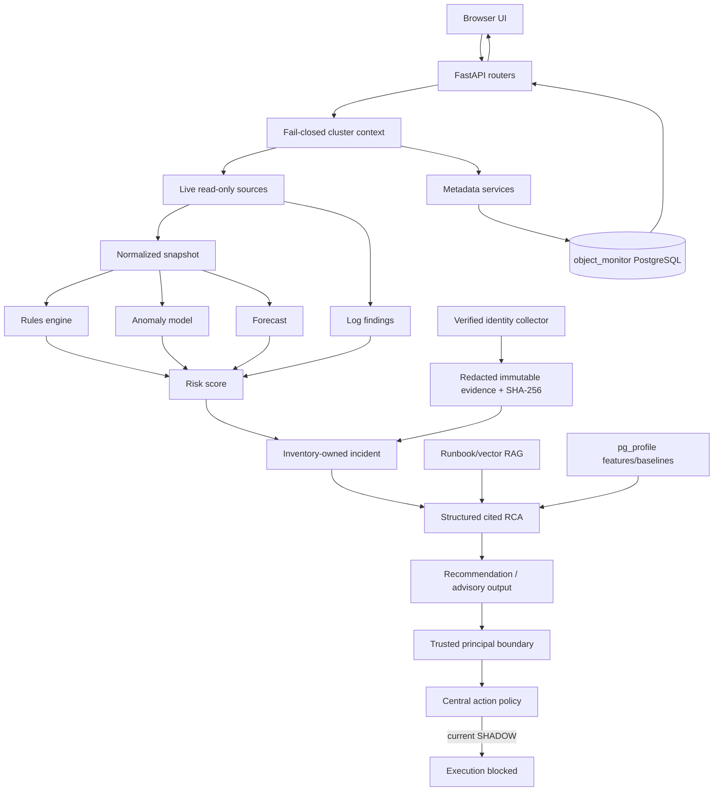
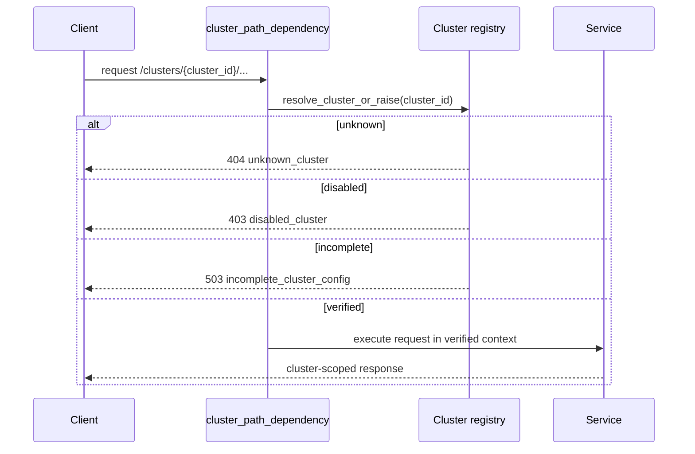

# Agentic Patroni Cluster — Complete Project Overview

One-line summary

Agentic Patroni Cluster (Object Monitor) is an OpenShift-native observability and guarded operations console for PostgreSQL (Patroni / Crunchy PGO) that provides monitoring, historical performance (pg_profile), ML anomaly/forecasting, RAG-assisted runbooks, immutable evidence collection, and a safety-first agentic operations pipeline (currently SHADOW — read-only).

## Stack
- Language(s): Python 3.12 (backend), JS/React (static frontend)
- Framework / runtime: FastAPI (Uvicorn) backend; React 18 + ECharts frontend (pre-built static assets)
- Notable libraries/dependencies:
  - SQLAlchemy + Alembic (metadata, migrations)
  - psycopg[binary] (PostgreSQL access)
  - pgvector (vector storage for embeddings)
  - fastembed (vendored cached model for embeddings)
  - scikit-learn / joblib (isolation forest, forecasting/training)

## Purpose and audience
- Purpose: provide cluster-aware monitoring, deterministic rule-based and ML risk detection, evidence-backed incident RCA and runbook retrieval (RAG), and a guarded Agentic workflow for recommendations and (eventually) automated actions.
- Audience: DBAs, SREs, platform operators running PostgreSQL on OpenShift who require strong evidence, auditability, and safe automation controls.

## Annotated top-level layout
```
Dockerfile                         image definition
requirements.txt                   Python runtime dependencies
app/                                FastAPI backend and domain code
  main.py                           FastAPI composition, startup and static serving
  sources.py                        live source adapters (oc, Prometheus, Loki, SQL)
  api_*.py                          HTTP routers (metrics, logs, AI, clusters...)
  pg_*.py                           PostgreSQL read-models and collectors
  ml/                                feature extraction, training, scoring (isolation forest, forecast)
  ai/                                RAG, embeddings, prompts and runbook retrieval
  pg_profile/                        historical performance collection and baselines
  services/                          domain services: inventory, incidents, recommendations, evidence
  db/                                SQLAlchemy models and Alembic migrations
static/                             pre-built React/ECharts UI (dist/, jsx sources)
infra/                              ai thresholds and metric mapping
tools/                              diagnostic/validation scripts and runners
vendor/fastembed_cache/             baked embedding model for offline RAG
docs/                               architecture and operational documentation
tests/                              pytest suite (integration / contract / security tests)
```

How it fits together
- Browser (static React) calls FastAPI /api and /api/v1 endpoints. FastAPI composes per-cluster dependencies (inventory) and orchestrates live reads through sources.py adapters (oc, Prometheus, Loki, Patroni REST, direct postgres). Normalized snapshots feed rules, ML scoring, forecasts and pg_profile historical analysis. Incidents are created/upserted into the metadata Postgres DB; evidence items are redacted, hashed (SHA-256) and appended. RAG retrieval uses vendored embeddings (pgvector) to provide cited runbook evidence to an LLM provider.

## Key runtime diagrams

One-page pipeline (mermaid):



Cluster isolation sequence (mermaid):



## How to run (shortest path)

Prerequisites: Python 3.12, Docker/Podman or OpenShift build if deploying; a PostgreSQL metadata DB for local dev (or use PGPORT/PGHOST env vars). For local development you can run the service standalone (some live sources will error if not available):

```bash
# create a venv, install deps
python3 -m venv .venv && source .venv/bin/activate
pip install -r requirements.txt

# run tests
python3 -m compileall app
pytest -q

# run the app locally (uvicorn)
export PORT=8080
uvicorn app.main:app --host 0.0.0.0 --port $PORT --workers 1
```

Container build (Dockerfile) — build image suitable for OpenShift:

```bash
docker build -t object-monitor:local .
# or use OpenShift binary build to create an ImageStream as the repository expects
```

Health & probes
- /livez and /api/v1/livez — process-only liveness/readiness (no upstream I/O)
- /api/v1/health — end-to-end checks for OpenShift (oc), PostgreSQL, Prometheus, Loki and metadata DB
- /metrics — Prometheus-format application metrics

## Configuration & safety flags
Important safety defaults (runtime envs found in README/Dockerfile):

- AGENTIC_WORKFLOW_ENABLED=false
- MCP_DIAGNOSTICS_ENABLED=false
- MCP_OPERATIONS_ENABLED=false
- AI_ACTION_EXECUTION_ENABLED=false
- EMERGENCY_FAILOVER_ENABLED=false
- AGENTIC_MODE=SHADOW
- PGC_ALLOW_MUTATIONS=0
- TRUSTED_IDENTITY_HEADERS=false

These ensure the Agentic pipeline remains read-only and fail-closed while in SHADOW rollout.

## Persistence & schema
- Metadata DB: database 'object_monitor' (separate from monitored cluster)
- SQLAlchemy models in app/db/models.py; Alembic revisions in app/db/migrations/versions/
- Key models: cluster_inventory, cluster_health_snapshot, ml_model_registry, ml_anomaly_score, ai_incident, ai_evidence_bundle, ai_evidence_item, ai_recommendation, ai_action_audit, pgprofile_* tables

## ML / RAG details
- Embeddings: vendored fastembed cache (vendor/fastembed_cache) used to compute and persist vectors to pgvector in metadata DB.
- ML: isolation forest-based anomaly scoring, joblib artifacts stored on disk with metadata in ml_model_registry.
- RAG: sanitized redaction -> embeddings -> pgvector retrieval -> bounded prompt to configured provider (Azure OpenAI by default). Schema and citation validation enforce evidence-backed outputs; invalid or unavailable provider falls back to deterministic outputs.

## Important files to review (representative)
- app/main.py — application entry and router composition
- app/sources.py — live-adapter boundary (oc, SQL, Prometheus, Loki)
- app/ai/*, app/ml/* — RAG and ML pipelines
- app/db/models.py — SQLAlchemy schema (metadata ownership)
- docs/CURRENT_END_TO_END_ARCHITECTURE.md — detailed architecture and diagrams (kept current)
- Dockerfile — image composition and runtime env defaults
- requirements.txt — pinned dependency set (vendored embedding model version noted)

## Tests and verification
- Run pytest (current suite ~77 tests per README)
- compileall to catch syntax issues: python3 -m compileall app
- evals/ directory contains an assistant evaluation suite that runs read-only assistant queries against a deployed route and produces reports in evals/reports/

## Charts and diagrams included
- This document includes two mermaid diagrams (pipeline and cluster isolation sequence). The repository's docs/CURRENT_END_TO_END_ARCHITECTURE.md contains an extensive set of mermaid diagrams for image contents, frontend, backend, ML/RAG, pg_profile, incident pipelines and evidence lifecycle. Use that doc as the long-form reference and this file as the single-page comprehensive overview.

## Next recommended actions (ops / contributors)
- Add a short CONTRIBUTING.md that explains local dev flow and how to run the embedded evals suite safely (evals are opt-in to avoid external model/query costs).
- Centralize secret and token rotation steps in infra and document rotation playbooks next to docs/TRUSTED_IDENTITY_AND_TOKEN_ROTATION_PREREQUISITES.md
- If you want a single PDF/diagram pack, I can generate a combined markdown -> PDF (with rendered mermaid diagrams) and place it in docs/ as docs/Agentic-Patroni-Complete-Overview.pdf — confirm if you want that.

---

Document created/updated by repository automation: comprehensive project overview and single-page diagrams.
