# Object Monitor Current End-to-End Architecture

**Document date:** 2026-07-17  
**System:** PostgreSQL Enterprise Console / Object Monitor  
**Current rollout stage:** `SHADOW`  
**Deployed namespace:** `monitoring`  
**Monitored PostgreSQL namespace:** `uat-pgcluster-uae`  
**Current deployed build:** `object-monitor-73`, deployment revision `116`

This document is the single current-state explanation of how the container image, browser frontend, FastAPI backend, live collectors, metadata PostgreSQL database, ML/RAG services, pg_profile history, immutable evidence, incident/RCA flow, identity boundary, and disabled action-control paths fit together.

It distinguishes three important states:

- **Implemented and active:** monitoring, read-only diagnostics, metadata persistence, ML/RAG, incident analysis, pg_profile, immutable identity evidence, and fail-closed cluster isolation.
- **Implemented but SHADOW/disabled:** action request/approval storage and guarded execution entry points.
- **Deferred:** production OAuth/JWT integration, normalized multi-party approvals, centralized operation execution, and enabled Patroni/database mutations.

---

## 1. System context

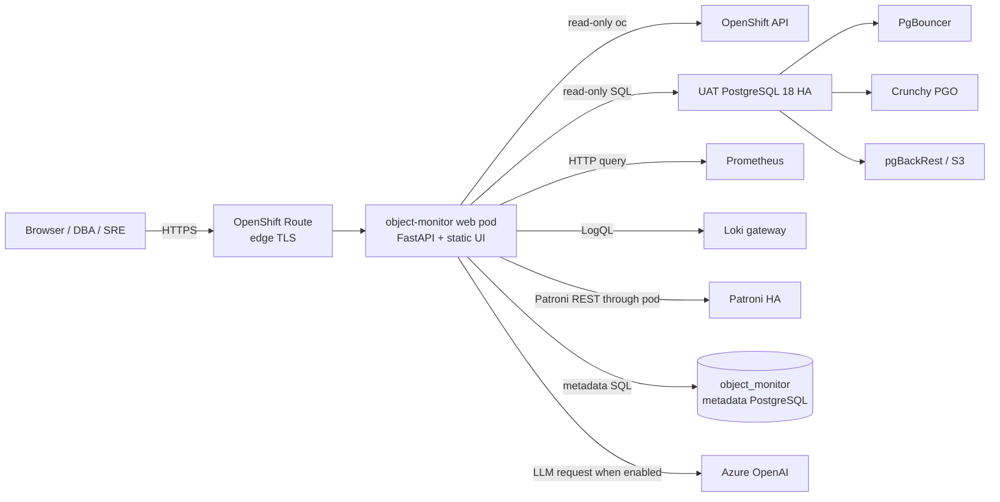

The web pod is a control-plane and observability application. In the current release it must not mutate the monitored PostgreSQL or OpenShift cluster through Agentic functionality.

---

## 2. Deployed OpenShift topology

| Component | Current role |
|---|---|
| `Deployment/object-monitor` | One web replica, Recreate strategy, FastAPI and static UI |
| `Service/object-monitor` | ClusterIP port 8080 |
| `Route/object-monitor` | Edge TLS, redirects insecure traffic |
| `ServiceAccount/object-monitor` | Read-only/live-source OpenShift access according to bound RBAC |
| `PostgresCluster/object-monitor-db` | Metadata database, separate from monitored UAT database |
| `Secret/object-monitor-db-app` | Metadata DB connection material |
| `Secret/object-monitor-region-uat` | Monitored UAT read credentials |
| `Secret/object-monitor-pgprofile-service-auth` | pg_profile service token; Deployment uses `secretKeyRef` |
| `Secret/pgprofile-remote-credentials` | pg_profile remote server configuration |
| `Deployment/object-monitor-llm` | Optional local LLM service; Azure OpenAI is the configured active provider |

The monitored PostgreSQL HA cluster is not the metadata database. Operational facts are read from `uat-pgcluster-uae`; AI/ML/evidence state is stored in database `object_monitor` on `object-monitor-db`.

---

## 3. Container image architecture

The image is built by the OpenShift binary `BuildConfig/object-monitor` from the repository archive.

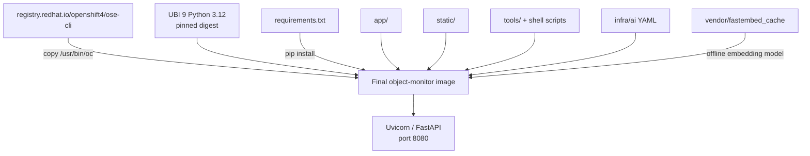

### Image contents

- `app/`: FastAPI API, source adapters, domain services, SQLAlchemy models, migrations, AI/ML/RAG and pg_profile.
- `static/`: HTML, CSS, React/ECharts screen sources and pre-built `dist/*.js` browser assets.
- `tools/`: validation, extraction and operational diagnostics.
- `infra/ai/`: metric mapping and deterministic thresholds.
- `vendor/fastembed_cache`: baked embedding model for offline/air-gapped semantic RAG.
- `oc`: copied from the Red Hat CLI image; `kubectl` is a symlink.

### Runtime properties

- Runs as non-root UID 1001 and is compatible with OpenShift restricted SCC.
- Uvicorn is PID 1 and listens on 8080.
- `WEB_CONCURRENCY` controls workers; deployed value is one worker.
- ONNX/OpenMP work is capped by `OMP_NUM_THREADS=1`.
- Hugging Face and transformer network access are disabled; embeddings use the baked cache.
- Liveness/readiness uses `/livez`, which performs no upstream I/O.

---

## 4. Browser frontend architecture

The frontend is a same-origin single-page application served by FastAPI from `static/`.

```mermaid
flowchart TB
    HTML[index.html] --> Vendor[React 18 + ReactDOM + ECharts]
    HTML --> Shared[data.js + components.jsx + icons.jsx]
    HTML --> Screens[screen-specific JSX/JS]
    HTML --> AIUI[ai_ops / assistant / AI platform modules]
    HTML --> App[dist/app.js router and shell]
    App --> API[/api and /api/v1 endpoints]
```

### Frontend implementation

- React 18 is loaded as pre-built browser scripts; no Node.js build runs in the container.
- Apache ECharts renders metrics, topology and analysis views.
- `static/dist/` is the deployed browser output.
- `static/*.jsx` contains source-style browser modules used to regenerate or audit corresponding distribution assets.
- Shared globals on `window` form the module registry.
- `dist/app.js` implements client-side routes and mounts screens.
- `dist/data.js` centralizes fetch behavior and cluster-aware URL construction.
- `styles.css` contains the violet enterprise theme, responsive layout and dark mode.

### Frontend functional bands

| Band | Representative screens |
|---|---|
| Overview | Executive health, topology, availability and risk summaries |
| Cluster/Patroni | Members, replication, WAL, archive, backup and DR readiness |
| Performance | Activity, waits, top SQL, slow SQL, locks, bloat, vacuum and index advice |
| Administration | Databases, schemas, objects, roles, privileges, HBA and configuration |
| Application monitoring | TPS, service, database/application activity and business views |
| Logs/metrics | Loki exploration, log analytics, Prometheus metrics and charts |
| pg_profile | Servers, runs, reports, history, baselines and incident links |
| AI Operations | Tuning, natural-language SQL, RAG/vector status, agent governance and branching |
| AI Assistant | Evidence-backed questions and cluster/database scope-aware answers |

### Browser-to-backend contract

The primary cluster-aware pattern is:

```text
/api/v1/clusters/{cluster_id}/...
```

Some compatibility and platform endpoints use `/api/v1/...`, `/api/...`, or `/api/ai-agent/...`. FastAPI includes explicit routers before the SPA fallback. Unknown `/api/*` paths return JSON 404 and never return `index.html`.

---

## 5. FastAPI backend architecture

`app/main.py` creates the application and composes routers for clusters, metrics, operations, performance, backups, replication, security, administration, logs, health checks, rules, ML, forecasts, incidents, scheduler, objects, AI actions, AI agent, AI v1, compatibility, recommendations, OpenShift views, UI screens, charts and pg_profile.

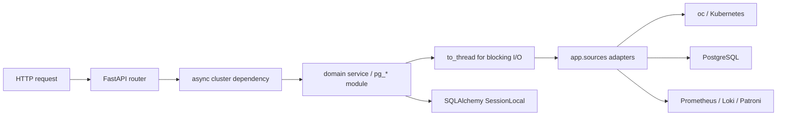

### Main backend layers

| Layer | Modules | Responsibility |
|---|---|---|
| API | `api_*.py` | HTTP contracts, dependency injection and response mapping |
| Cluster/source boundary | `sources.py`, `loki.py` | Verified per-request cluster context and live access adapters |
| Read models | `pg_*.py`, `openshift_rag.py`, collectors | PostgreSQL/OpenShift/Patroni/Prometheus/Loki normalization |
| Domain services | `services/` | Snapshots, inventory, incidents, AI agent, approval, evidence and provider logic |
| ML | `ml/` | Feature matrix, baseline, isolation forest, scoring, forecasting and risk scoring |
| AI/RAG | `ai/` | Runbooks, embeddings, retrieval, prompting and deterministic DBA explanation |
| Historical performance | `pg_profile/` | Collection, sanitized reports, feature extraction, baselines and RCA integration |
| Persistence | `db/` | SQLAlchemy models, engine/session, bootstrap and Alembic migrations |
| Compatibility operations | `jobs.py`, `cutover/` | Legacy guarded job/cutover paths; mutation remains disabled |

---

## 6. Fail-closed cluster isolation

Cluster isolation is a foundational security boundary.

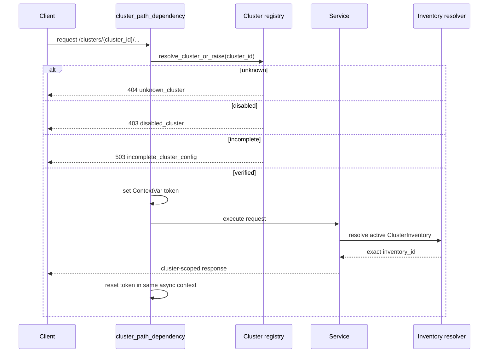

Key rules:

- An explicit unknown, disabled or incomplete cluster never substitutes the default cluster.
- The FastAPI dependency is an async generator so ContextVar set/reset occurs in the same async context.
- Blocking calls execute through `to_thread`; AnyIO copies the verified request context.
- `inventory_service.resolve()` is the single metadata ownership resolver.
- Inventory namespace and canonical cluster name must match the verified active configuration.
- Snapshots, ML training/scoring, forecasts, incidents, RCA, AI runs and recommendations are cluster/inventory scoped.
- The three historical UAT incidents were deterministically backfilled to verified inventory ID 1; no incident remains unassigned.

---

## 7. Live monitoring data pipeline

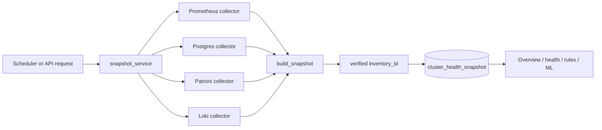

Live sources:

- OpenShift pod and CR state through `oc` using the pod ServiceAccount.
- PostgreSQL through direct psycopg or `oc exec ... psql`, depending on cluster configuration.
- Patroni REST from the database pod.
- Prometheus instant/range API.
- Loki query API.

The source layer raises sanitized `SourceError` failures. Health and UI routes either report source failure explicitly or apply documented presentation fallbacks.

---

## 8. Metadata database architecture

The metadata database is PostgreSQL database `object_monitor` on `object-monitor-db`. SQLAlchemy models are in `app/db/models.py`; Alembic revisions are in `app/db/migrations/versions/`.

### Core ownership and health

| Table/model | Purpose |
|---|---|
| `cluster_inventory` | Canonical monitored cluster identity and endpoints |
| `cluster_health_snapshot` | Timestamped normalized operational features |
| `ml_model_registry` | Per-cluster trained model metadata and artifact path |
| `ml_anomaly_score` | Snapshot/model anomaly results |
| `ml_forecast_result` | Inventory-scoped capacity/risk forecasts |

### Incidents and agent recommendations

| Table/model | Purpose |
|---|---|
| `ai_incident` | Inventory-owned incident, evidence, findings, summary and lifecycle |
| `ai_agent_run` | Cluster-specific agent run metadata |
| `ai_recommendation` | Recommendation, evidence, approval and execution status |
| `ai_action_audit` | Action request/approval/execution audit history |
| `ai_dba_model_run` | Recommendation-engine run metadata |
| `ai_sql_fingerprint` | Normalized SQL workload fingerprints |
| `ai_dba_recommendations` | Deterministic DBA recommendations |
| recommendation evidence/feedback tables | Evidence linkage and operator feedback |

### Knowledge and pg_profile

| Table/model | Purpose |
|---|---|
| `ai_knowledge_base` | Runbooks and embedded retrieval content |
| `pgprofile_server` | Registered historical source |
| `pgprofile_sample_run` | Collection execution metadata |
| `pgprofile_report` | Sanitized report metadata/content boundary |
| `pgprofile_feature` | Extracted interval/query features |
| `incident_pgprofile_report` | Incident/report relationship |
| `query_performance_baseline` | Robust query/window baselines |

### Immutable Agentic evidence foundation

| Table/model | Purpose |
|---|---|
| `ai_evidence_bundle` | Incident/window/inventory evidence envelope and quality state |
| `ai_evidence_item` | Append-only redacted payload with canonical SHA-256 |
| `ai_tool_invocation_audit` | Tool name/version/mode/status and input/output hashes |
| `ai_workflow_run` | Inventory/incident workflow status in SHADOW or later modes |

The live schema is baselined at Alembic revision `20260717_0010`. Revision 0010 added nullable incident inventory ownership plus the four evidence tables. Nullable migration semantics protected legacy rows until deterministic backfill was completed.

---

## 9. ML anomaly and forecasting pipeline

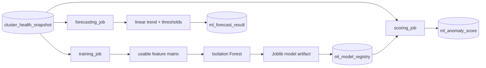

Safety and isolation:

- Training reads snapshots for exactly one verified inventory.
- Scoring selects the latest snapshot for the same inventory as the active cluster model.
- Forecast history and results are inventory scoped.
- Baseline feature summaries never combine cluster inventories.
- Model files are stored in the configured model directory; metadata is stored in PostgreSQL.

---

## 10. Incident, risk and RCA pipeline

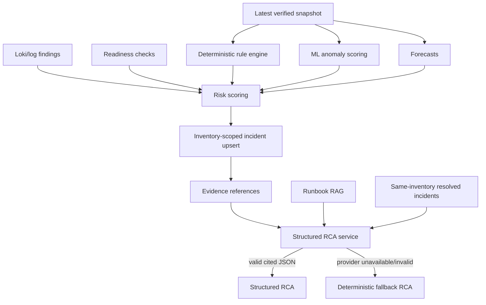

RCA rules:

- Incident access must match the active verified inventory.
- Similar incidents are retrieved only from the same inventory.
- Evidence text is treated as untrusted data, not instructions.
- Model claims must cite known evidence IDs.
- Invalid JSON, unknown citations or unavailable providers fall back to deterministic output.
- RCA does not execute SQL, shell, OpenShift or Patroni actions.

---

## 11. RAG and LLM pipeline

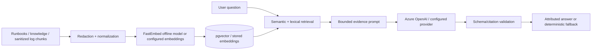

Provider selection and health are implemented in `services/ai_provider.py`. The current deployment uses Azure OpenAI configuration. Secrets are supplied through Kubernetes Secrets and must never be written into prompts, logs or evidence.

The embedding cache is baked into the image so semantic retrieval can operate without Hugging Face egress.

---

## 12. pg_profile historical pipeline

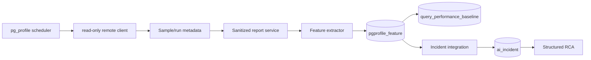

Security properties:

- Remote connection material is mounted from a Kubernetes Secret.
- The service token is now supplied by `Secret/object-monitor-pgprofile-service-auth`, not a literal Deployment value.
- Report HTML is sanitized and served with a restrictive CSP.
- Secret/error sanitization occurs before persistence or response.
- Full report HTML is excluded from LLM prompts; only reviewed/sanitized features and metadata are used.

Actual token rotation is deferred until external consumers are inventoried. Current value migration to a Secret did not change the token.

---

## 13. Immutable identity evidence pipeline

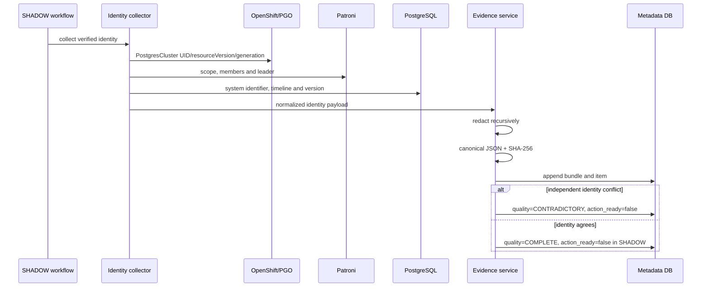

The deployed live identity bundle verified:

- inventory ID and configured cluster ID `uat`;
- PostgresCluster `uat-pgcluster-uae` and namespace;
- Patroni scope `uat-pgcluster-uae-ha` and leader;
- PostgreSQL system identifier and timeline;
- PostgreSQL version and primary identity.

Evidence is redacted before hashing. Evidence service APIs append bundles/items and expose no update/delete evidence endpoint.

---

## 14. Trusted principal boundary

Privileged APIs do not derive authority from request JSON fields such as `actor`, `requested_by`, `roles` or `actor_roles`.

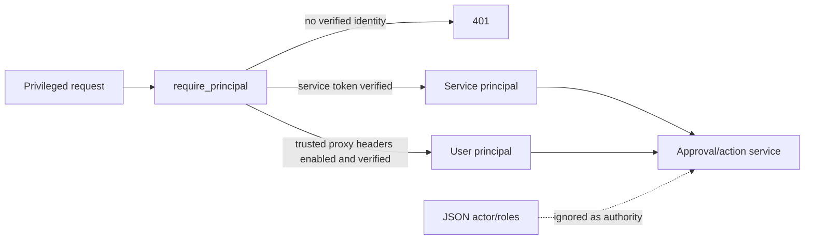

`Principal` contains immutable subject ID, display name, trusted roles, authentication source, authentication strength and service-account status.

### Current deployment state

- `TRUSTED_IDENTITY_HEADERS=false`.
- The Route terminates edge TLS directly to the web Service.
- No OAuth proxy container or verified JWT contract exists in the namespace.
- Privileged requests without a verified service identity return HTTP 401.
- Trusted headers must not be enabled until the Route exposes only a reviewed OAuth proxy or the application validates signed JWTs itself.

---

## 15. Agentic action-control pipeline and safety state

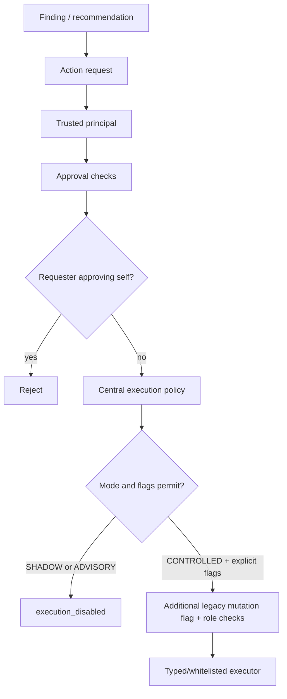

### Explicit deployed safety values

```text
AGENTIC_WORKFLOW_ENABLED=false
MCP_DIAGNOSTICS_ENABLED=false
MCP_OPERATIONS_ENABLED=false
AI_ACTION_EXECUTION_ENABLED=false
AI_AGENT_EXECUTION_ENABLED=false
AI_AGENT_INDEX_DDL_ENABLED=false
EMERGENCY_FAILOVER_ENABLED=false
AGENTIC_MODE=SHADOW
PGC_ALLOW_MUTATIONS=0
TRUSTED_IDENTITY_HEADERS=false
```

Therefore:

- SHADOW cannot execute cluster or database changes.
- ADVISORY cannot execute actions.
- Payload roles cannot authorize execution.
- SQL executor returns blocked before contacting PostgreSQL.
- Generic/lifecycle jobs are blocked before executor invocation.
- Emergency failover and operations MCP are disabled.
- No claim of production approval quorum is made.

Legacy cutover runner/wrapper code remains packaged for compatibility but is not an enabled Agentic execution path. It must be centralized behind future typed policy/precheck/execution/postcheck controls before use.

---

## 16. Startup, scheduling and health

At application startup:

1. `bootstrap_metadata` validates AI configuration and creates missing metadata tables. Alembic remains the authoritative evolution path for existing schemas.
2. `scheduler_service.maybe_start_from_env` starts configured read-only snapshot/analysis scheduling.
3. The pg_profile/ASH background sampler starts according to its flags.

Health endpoints:

| Endpoint | Meaning |
|---|---|
| `/livez`, `/healthz`, `/api/v1/livez` | Process-only health; no upstream calls |
| `/api/health`, `/api/v1/health` | End-to-end Kubernetes, PostgreSQL, Prometheus, Loki and metadata status |
| `/metrics`, `/api/v1/metrics` | Prometheus-format application metrics |
| `/api/v1/ai/config` | Redacted runtime feature/safety configuration |

---

## 17. Build, migration and deployment pipeline

```mermaid
flowchart LR
    Source[Repository] --> Compile[compileall + pytest]
    Compile --> Archive[versioned tar/zip artifact + SHA-256]
    Archive --> Build[OpenShift binary build]
    Build --> Registry[external Quay digest]
    Registry --> Copy[registry-level rollback copy]
    Copy --> Schema[validated additive Alembic migration]
    Schema --> Deploy[set immutable image digest]
    Deploy --> Rollout[OpenShift rollout status]
    Rollout --> Validate[livez + fail-closed + read-only suite + logs]
```

Deployment lessons now encoded in operations:

- Validate the full Alembic chain on a disposable PostgreSQL database first.
- Pre-provision extensions such as `vector` through a privileged infrastructure step.
- Bootstrap-managed existing databases must be baselined carefully before additive revision application.
- Create an actual registry manifest copy for rollback before replacing `latest`; an ImageStream reference alone does not preserve an external manifest.
- Deploy immutable digests, not mutable tags.
- Treat valid-cluster HTTP 500, pod restarts, migration failure or safety flag drift as rollback gates.

---

## 18. Security boundaries and secret handling

- Database, provider and service credentials come from Kubernetes Secrets.
- The architecture document, evidence and logs must never contain decoded credentials.
- Error sanitizers redact common password/token/secret/DSN patterns.
- Evidence recursively redacts secret-like keys before canonical hashing.
- pg_profile HTML is sanitized and isolated by CSP.
- Static file serving prevents path traversal outside `static/`.
- Unknown API paths return JSON 404.
- OpenShift reads are namespace-scoped where cluster-wide access is forbidden.
- Logical replication and HA identity checks use the direct primary path, never PgBouncer.
- All action readiness remains false while evidence is stale, partial or contradictory, and throughout SHADOW rollout.

---

## 19. Current known limitations and next architecture stages

1. **Identity deployment:** JWT and secret-bound trusted-proxy validation are implemented, but deployment-specific issuer/key/proxy configuration must still be supplied and verified. Defaults remain disabled.
2. **Token rollout:** Dual current/next constant-time token acceptance is implemented; actual rotation waits for the external-consumer inventory.
3. **Approval control:** Approvals and rejections are normalized per subject and bound to an immutable canonical SHA-256 action plan with expiry and role-qualified quorum.
4. **Operation centralization:** API jobs pass the typed central action-control service. Vendored cutover compatibility code is retained but L4/L5 execution is prohibited by central policy.
5. **Evidence conversion:** Agentic Prometheus, Loki, PostgreSQL and Patroni collector outputs persist as redacted, hashed, append-only incident-window items; partial sources force the bundle non-actionable.
6. **Controlled release:** Only allowlisted L3 actions can become eligible, and only with current SHADOW and backup/recovery evidence. Patroni L4 and all L5/forced failover remain prohibited.
7. **Operational attestations:** Senior roles can record hashed, expiring identity, SHADOW and backup/recovery evidence. No repository code fabricates these external facts; absent or expired proof fails closed.

---

## 20. Repository map

```text
object_monitor_v31_dba_fixed/
├── Dockerfile                       image definition
├── requirements.txt                 Python runtime dependencies
├── app/
│   ├── main.py                      FastAPI composition and static serving
│   ├── sources.py                   fail-closed cluster/live-source boundary
│   ├── api_*.py                     HTTP routers
│   ├── pg_*.py                      PostgreSQL read models
│   ├── collectors/                  Prometheus/Postgres/Patroni/Loki collectors
│   ├── services/                    snapshots/incidents/AI/evidence/security logic
│   ├── ml/                          anomaly, baseline, forecast and risk pipeline
│   ├── ai/                          RAG, embeddings, prompts and runbooks
│   ├── pg_profile/                  historical performance pipeline
│   ├── cutover/                     disabled compatibility orchestration
│   └── db/
│       ├── models.py                SQLAlchemy metadata schema
│       └── migrations/              Alembic schema history
├── static/
│   ├── index.html                   SPA entry point
│   ├── styles.css                   theme/layout
│   ├── *.jsx / *.js                 UI source modules
│   ├── dist/                        deployed browser assets
│   └── vendor/                      React/ECharts browser libraries
├── infra/ai/                        thresholds and metric mapping
├── tools/                           validation and diagnostics
├── tests/                           offline contract/security/isolation tests
├── docs/                            architecture and operational documentation
└── vendor/fastembed_cache/          offline embedding model
```

---

## 21. One-page pipeline summary

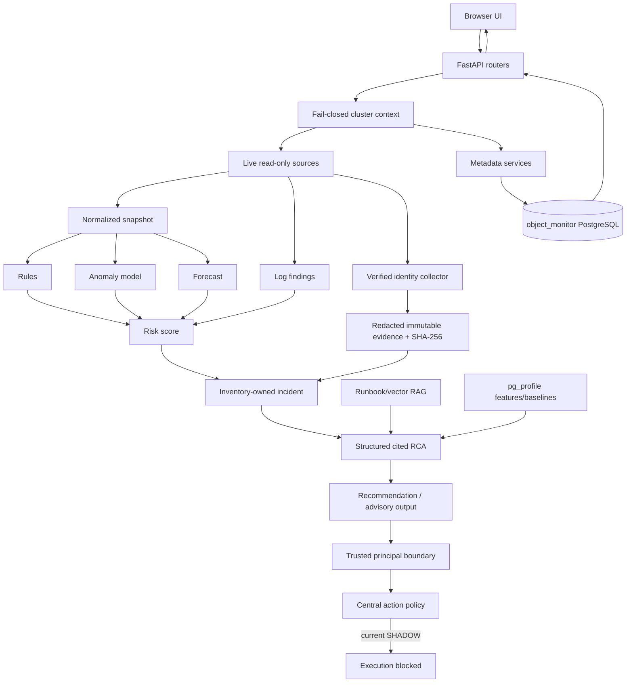

The current architecture deliberately ends the action pipeline at **Execution blocked**. Monitoring, evidence, analysis and recommendations are live; cluster mutation is not.
